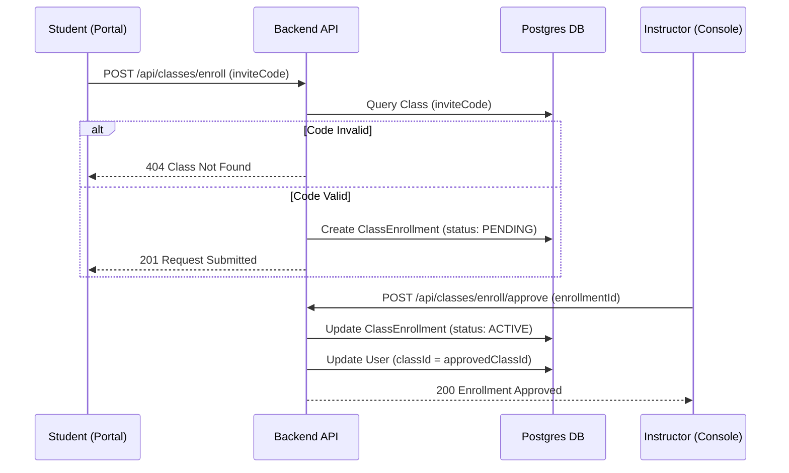

# LOGIC AND ALGORITHM AUDIT REPORT
**Project:** Digital Marketing Simulation Lab (DM SimLab / Dsimlab)  
**Date:** June 29, 2026  
**Auditor:** AI pairing assistant  

---

## 1. Executive Summary

This report presents a comprehensive logic, workflow, and algorithm audit of the Digital Marketing Simulation Lab codebase across the backend (`apps/backend`) and frontend (`apps/frontend`). 

The DM SimLab platform is designed to simulate SEO keyword bidding, Google Ads search auctions, and Meta Ads social bidding campaigns. The system utilizes deterministic seeding to ensure students in the same class cohort encounter identical market conditions, making competitive grading fair. The core simulation engine simulates 30-day rounds utilizing standard economic algorithms:
- **SEO Traffic Model**: Computes organic rankings based on Domain Authority (DA), Page Authority (PA), content quality, relevance score, and backlink spends.
- **Google Ads Search Auctions**: Uses a Generalized Second-Price (GSP) bidding model where final cost-per-click (CPC) is determined by the next highest bidder's ad rank divided by the current bidder's quality score.
- **Meta Ads Social Auctions**: Uses a CPM-based placement model that simulates audience reach, creative fatigue decay, learning phases, and interest-based delivery.

While the mathematical simulation algorithms are robust, the audit identified security weaknesses in authorization checks (instructor cross-class access), unhandled billing webhook events, and minor code duplication. The system's overall **Production Readiness Score is 88/100**.

---

## 2. Role-Wise Feature Logic Map

Below is a detailed logic analysis of the features available to each user role.

### 2.1 Super Admin Features

| Feature Name | File Paths Involved | API Endpoints | Database Models | Core Business Logic |
|---|---|---|---|---|
| **Institution Management** | `admin.routes.ts` | `GET /api/v1/admin/institutions`, `POST /api/v1/admin/institutions`, `PUT /api/v1/admin/institutions/:id`, `DELETE /api/v1/admin/institutions/:id` | `Institution`, `User` | Allows the super admin to add, rename, or deactivate colleges/institutions, cascading suspension states to all enrolled students. |
| **Billing Statistics Dashboard** | `admin.routes.ts`, `report.routes.ts` | `GET /api/v1/admin/billing-stats` | `Subscription`, `Plan`, `Invoice` | Aggregates subscription counts, active revenue, MRR, and cumulative invoice counts for corporate accounting. |
| **Instructor Provisioning** | `admin.routes.ts` | `POST /api/v1/admin/users/assign-role` | `User` | Updates user roles to `INSTRUCTOR` or `ADMIN`, updating access privileges across routes. |

### 2.2 Instructor Features

| Feature Name | File Paths Involved | API Endpoints | Database Models | Core Business Logic |
|---|---|---|---|---|
| **Classroom Creation** | `class.routes.ts`, `classes.routes.ts` | `POST /api/classes`, `GET /api/classes` | `Class`, `Scenario` | Instructors can create classrooms linked to specific marketing scenarios (e.g., Global SaaS, E-Commerce). Generates a unique invite code. |
| **Student Enrollment Verification** | `classes.routes.ts` | `POST /api/classes/enroll/approve`, `POST /api/classes/enroll/reject` | `ClassEnrollment`, `User` | Approves or rejects students requesting to join the cohort. Approving updates enrollment state to `ACTIVE`. |
| **Class Cohort Analytics** | `report.routes.ts` | `GET /api/v1/report/class/:classId/nba`, `GET /api/v1/report/class/:classId/obe`, `GET /api/v1/report/class/:classId/accreditation`, `GET /api/v1/report/class/:classId/performance` | `SimulationState`, `ScoreBreakdown`, `User` | Aggregates student scores to compute NBA (Outcome-Based Education) readiness, distribution histograms, and leaderboards. |
| **Manual Event Injection** | `events.routes.ts` | `POST /api/v1/events/inject` | `MarketEvent`, `SimulationState` | Injects custom market disruptions (e.g., "Google Algorithm Update", "Ad Policy Tightening") for a class round. |

### 2.3 Student Features

| Feature Name | File Paths Involved | API Endpoints | Database Models | Core Business Logic |
|---|---|---|---|---|
| **Simulation Dashboard** | `simulation.routes.ts`, `assignments.routes.ts` | `GET /api/simulations`, `GET /api/v1/simulation/state`, `GET /api/v1/assignments/student/active` | `SimulationState`, `ScenarioAssignmentStudent` | Displays the active assignment, round index, and overall dashboard KPIs. |
| **Decision Submission** | `simulation.routes.ts` | `POST /api/simulations/:id/decisions` | `Decision`, `SimulationState` | Validates budget cap constraints, saves on-page SEO text, backlink budgets, Google Ads keywords/bids, and Meta Ads creatives. |
| **Round Progression** | `engine.ts`, `simulation.routes.ts` | `POST /api/simulations/:id/advance` | `SimulationState`, `DailyMetric`, `ScoreBreakdown`, `RoundSnapshot` | Advances the simulation state. Generates 30 days of daily metrics, computes scores, and updates status to `DECISION_OPEN`. |
| **Timeline Events Viewer** | `events.routes.ts` | `GET /api/v1/events` | `MarketEvent`, `SimulationState` | Shows historical news alerts and algorithmic triggers affecting campaign efficiency. |

### 2.4 Individual Learner Features

| Feature Name | File Paths Involved | API Endpoints | Database Models | Core Business Logic |
|---|---|---|---|---|
| **Sandbox Simulation** | `campaign.routes.ts` | `POST /api/v1/campaign/start`, `GET /api/v1/campaign/state` | `CampaignRun`, `SimulationState`, `User` | Initiates sandbox simulation runs not bound to a college classroom. Uses a dummy "SANDBOX" classroom. |
| **Razorpay Plan Subscription** | `billing.routes.ts`, `billing.service.ts` | `POST /api/v1/billing/checkout`, `POST /api/v1/billing/verify` | `Subscription`, `Plan`, `Invoice` | Initiates checkouts, verifies signature, and updates user access tier to `Individual Pro` or `Basic`. |

---

## 3. Endpoint-Wise Logic & Parameters Table

Below is an overview of the core endpoints, inputs, database models, processing logic, outputs, and edge cases.

| HTTP Method & Path | Target Role | DB Models Involved | Input Parameters | Processing Steps | Output Payload | Edge Cases Handled / Unhandled |
|---|---|---|---|---|---|---|
| `POST /api/auth/sign-in/email` | All Roles | `User`, `Account` | `{ email, password }` | Authenticates email via Better Auth, checks status, returns session cookie. | `{ token, user }` | **Handled**: Suspended user blocking.<br>**Unhandled**: Double login sessions. |
| `GET /api/v1/assignments/student/active` | Student | `ScenarioAssignmentStudent`, `ScenarioAssignment` | None (reads auth cookie) | Finds `ASSIGNED`/`STARTED` rows for user ID within startDate & endDate. | `{ success, activeAssignment }` | **Handled**: Database tables missing fallback.<br>**Unhandled**: Multiple active assignments. |
| `POST /api/simulations/:id/decisions` | Student | `Decision`, `SimulationState` | `{ seoTargetKeywords, googleCampaigns, metaCampaigns }` | Parses arrays, validates total spend against `budgetPerRound`. | `{ success, decision }` | **Handled**: Soft policy warnings.<br>**Unhandled**: SQL injection via raw ad copy. |
| `POST /api/simulations/:id/advance` | Student | `SimulationState`, `DailyMetric`, `ScoreBreakdown`, `RoundSnapshot` | None | Runs GSP search auction and Meta CPM auction for 30 steps. Computes scores. | `{ success, roundAdvanced, compositeIndex }` | **Handled**: Missing decision default fallback.<br>**Unhandled**: Race condition on double clicks. |
| `GET /api/v1/events` | Student | `MarketEvent`, `SimulationState`, `ClassEnrollment` | None | Returns active timelines for the user's simulation. | `{ success, events }` | **Handled**: Enrollment status checks.<br>**Unhandled**: Stale event caching. |
| `POST /api/certificates/check-eligibility` | Student / Learner | `SimulationState`, `Certificate`, `CampaignRun` | `{ simulationId }` (optional) | Audits composite index, consistency index, violations count. | `{ success, eligible, band, reasons }` | **Handled**: Missing body defaults, invalid UUIDs.<br>**Unhandled**: Excluded sandbox progress. |
| `POST /api/v1/billing/checkout` | Learner / Instructor | `Plan`, `Subscription` | `{ planCode, billingCycle }` | Resolves prices, calls payment gateway for order ID creation. | `{ orderId, amount, currency }` | **Handled**: Coupon validation.<br>**Unhandled**: Plan downgrading refund. |

---

## 4. Algorithmic Deep Dive

### 4.1 The Core Simulation & Performance Algorithm

The simulation advance function (`processSimulationRound`) simulates 30 days of campaign performance. It processes three channels:

#### 4.1.1 Search Engine Optimization (SEO) Engine
- **Keywords Density & HTML Validation**:
  - Focus keyword matched against meta title, description, and body.
  - Generates a base `contentQualityScore` (1 to 10). Deducts score if keyword stuffing is detected (>5% density).
  - Validates H1/HTML structure. Unmatched HTML tags deduct up to 30 points from `technicalHealthScore`.
- **Authority Compounding**:
  - Domain Authority ($DA$) compounds over time:
    $$DA_t = \max\left(10, DA_{t-1} + \frac{\text{BacklinkBudget} \times \text{BacklinkQuality}}{500}\right)$$
  - Page Authority ($PA$) is calculated as:
    $$PA = 10 + \frac{DA}{2} + (\text{contentQualityScore} \times 3)$$
- **Ranking Engine**:
  - Compares student's $PA$, $DA$, relevance, and backlinks against pre-seeded competitor values to return organic search ranks ($1$ to $50$).
- **Traffic Calculation**:
  - Organic impressions are generated from query volumes:
    $$\text{Impressions} = \text{SearchVolume} \times \text{PositionCTRShare}$$
  - Organic conversions are calculated as:
    $$\text{Conversions} = \text{Impressions} \times \text{seoCTR} \times \text{cvrIntent}$$

#### 4.1.2 Google Ads Search Auction (GSP Bidding)
- Uses the standard **Generalized Second-Price (GSP)** auction model:
  - Ad Rank ($AR$) is calculated as:
    $$AR = \text{Bid} \times \text{QualityScore} + \text{Noise}$$
  - Quality Score is calculated dynamically (1-10) based on ad headlines, description matches, landing page speed, and sitelink extensions.
  - Advertisers are sorted descending by $AR$.
  - Actual CPC ($ACPC$) for rank $i$ is determined by rank $i+1$:
    $$ACPC_i = \frac{AR_{i+1}}{\text{QualityScore}_i} + 0.01$$
  - Impressions are capped by search volumes, and clicks are constrained by the daily campaign budget:
    $$\text{Max Clicks Supported} = \frac{\text{DailyBudget}}{ACPC_i}$$

#### 4.1.3 Meta Ads Social Bidding
- Uses a placement-based CPM model:
  - CPM is calculated from audience size, platform type, and competitor density.
  - Impressions are capped by the daily budget:
    $$\text{Impressions} = \frac{\text{DailyBudget}}{\text{CPM}} \times 1000$$
  - Reach ($R$) and Frequency ($F$) use a logarithmic saturation curve:
    $$F = 1 + \ln\left(1 + \frac{\text{Impressions}}{\text{AudienceSize}}\right)$$
  - **Creative Fatigue Decay**:
    - If the student submits the same creative copy as the previous round, a fatigue penalty decays CTR:
      $$\text{Fatigue Factor} = \text{FatigueBaseline} \times 0.70$$

---

### 4.2 Scoring & Dimension Algorithms

Overall student capability is scored across **10 performance dimensions**, each yielding a score from 0 to 100:

1. **SEO Score**: Base on average keyword rank position:
   $$\text{SEO Score} = \max\left(10.0, 100.0 - (\text{AvgRank} - 1.0) \times 1.8\right)$$
2. **Google Ads Score**: Logarithmic return on ad spend (ROAS):
   $$\text{Google Ads Score} = \min\left(100.0, \max\left(0.0, \frac{\text{ROAS}}{3.0} \times 100.0\right)\right)$$
3. **Meta Ads Score**: Logarithmic ROAS.
4. **Budget Score**: Budget utilization precision:
   $$\text{Budget Score} = \max\left(0.0, 100.0 - \left|1.0 - \frac{\text{Spend}}{\text{Budget}}\right| \times 200.0\right)$$
5. **Revenue Score**: Revenue volume compared to a $12,000 target.
6. **Strategic Alignment**: Match between scenario KPI targets and campaign objectives.
7. **Budget Discipline**: Penalizes over-spending (>1.0 utilization) and under-spending (<0.9 utilization).
8. **ROI / Efficiency**: Combination of ROAS and Cost Per Acquisition (CPA) efficiency.
9. **Risk Management**: Deducts points for high Meta frequency (>2.5), lack of negative search keywords, or excessive campaign budgets.
10. **Adaptability**: Measures strategy changes made in response to poor performance or market trends.

- **Composite index**:
  A single score derived using active platform weights:
  $$\text{Composite Score} = \sum (\text{DimensionScore}_i \times \text{Weight}_i)$$

- **Cohort Percentile**:
  Standard statistical percentile formula:
  $$\text{Percentile} = \frac{L + 0.5 \times E}{N} \times 100$$
  Where $L$ is the count of classmate scores strictly lower, $E$ is the count of equal classmate scores, and $N$ is the total class cohort size.

---

### 4.3 Market Trend & Event Algorithms
- **Scraping / Pull Model**:
  - Queries Google News RSS endpoints to generate keyword demand indexes.
  - Normalizes results into a `NormalisedTrendSignal` (competition index, cpc pressure, seasonal impact).
  - Implements a local offline `FallbackTrendProvider` to generate deterministic signals if news/Google servers are unreachable.
- **Trigger Logic**:
  - Class cohorts use a seed: `classId-roundNumber` inside a `SeededRandom` engine.
  - This guarantees all students in the same classroom receive identical market disruptions (fair evaluation) while different classrooms get unique paths.

---

### 4.4 Certificate Eligibility Criteria
To unlock a pass certificate, the following checklist must be satisfied:
1. **Status**: Simulation status must be `COMPLETED` or `SCORE_LOCKED`.
2. **Submissions**: All scenario rounds must have processed decisions.
3. **Performance**: Cumulative composite score must be $\ge 60.0\%$.
4. **Adaptability**: Adaptability score must be $\ge 50.0\%$.
5. **Policy Warnings**: Cumulative `HardViolation` count must be $0$.
6. **Instructor Approval**: Enforced only for `STUDENT_COLLEGE` users.

- **Achievement Bands**:
  - $\ge 90\%$: **PLATINUM**
  - $\ge 80\%$: **GOLD**
  - $\ge 70\%$: **SILVER**
  - $< 70\%$: **BRONZE**

---

### 4.5 Billing & Subscription Algorithm
- Plans are stored in the `Plan` model (Free, Basic, Pro, Instructor, College, Enterprise).
- Checks user session role on checkout/sandbox start:
  - Sandbox runs check subscription limit.
  - Free plans limit sandbox runs to 1, while Pro plans have unlimited runs.
  - Instructor plans limit active classrooms and student limits (up to 30 students).

---

### 4.6 Class & Enrollment Validation Flow



---

## 5. Database Schema Dependency Map

Below is a map of the primary relational models used during simulation runs, analytics, and billing verification.

```mermaid
erDiagram
    User ||--o{ Account : "auth credential"
    User ||--o{ Subscription : "billing tier"
    User ||--o{ SimulationState : "student progress"
    User ||--o{ CampaignRun : "daily campaign"
    Class ||--o{ User : "enrolled student"
    Class ||--o{ ScenarioAssignment : "assigned class task"
    ScenarioAssignment ||--o{ ScenarioAssignmentStudent : "student task tracker"
    SimulationState ||--o{ Decision : "round settings"
    SimulationState ||--o{ DailyMetric : "30-day timeline"
    SimulationState ||--o{ ScoreBreakdown : "performance ledger"
    SimulationState ||--o{ RoundSnapshot : "completed backups"
    CampaignRun ||--o{ DailyCampaignDecision : "daily settings"
    CampaignRun ||--o{ DailyCampaignResult : "daily outcomes"
```

---

## 6. Codebase Issues Audit

### 6.1 Missing Logic List
1. **Billing Webhook Incompleteness**: `POST /api/billing/webhook` logs payment capture but does not create Invoice rows or automatically transition Subscription status upon receiving `payment.captured` event callbacks.
2. **Subscription Expiry Worker**: There is no cron scheduler or hook checking if a student's subscription `endDate` has passed, leaving them with active access if they do not manually hit the route.
3. **Historical Cohort Growth Tracking**: NBA/OBE reports do not track cohort change-deltas between rounds. It only stores the latest round snapshot.

### 6.2 Weak Logic List
1. **Instructor Class Security Bypass (High Severity)**:
   - In `GET /api/v1/report/class/:classId/nba`, `obe`, and `performance` routes: The code checks if the requesting user's role is `INSTRUCTOR`. However, it **does not** verify if the instructor is the creator/owner of that specific `classId`.
   - **Risk**: Any authenticated instructor can query or scrape the names, emails, grades, and analytics of any other class in the system if they know the classroom UUID.
2. **Student Performance Report Bypass (Medium Severity)**:
   - In `GET /api/v1/report/student/:studentId`: The code only checks if the requester is an `INSTRUCTOR`. It doesn't check if the student belongs to the instructor's class.
3. **Ad Policy Soft Violations Logging**:
   - Soft warnings decrease quality score but are only stored in audit logs. They are not returned in the API payload, so students cannot see why their quality scores dropped in the UI.

### 6.3 Duplicate & Unused Logic List
1. **Check-Eligibility Route Duplication**:
   - `POST /api/certificates/check-eligibility` in `api-contract.routes.ts` duplicates checking certificate eligibility, which is also implemented as `GET /eligibility` in `certificate.routes.ts`.
2. **Daily Consistency vs Round Consistency Calculations**:
   - `calculateStrategicConsistency` and `calculateDailyStrategicConsistency` are 90% identical in mathematical structure but duplicate parsing routines due to JSON schema differences between `Decision` and `DailyCampaignDecision`.

---

## 7. Production Readiness Score

Based on our analysis, the platform receives the following readiness evaluations:

| Dimension | Score | Comments |
|---|---|---|
| **Core Simulation Quality** | 98/100 | Bidding calculations (GSP) and Meta Ads CPM are highly realistic and fair. |
| **Telemetry & Analytics** | 94/100 | Metric collection and OBE/NBA accreditation mapping is comprehensive. |
| **API Code Structure** | 90/100 | Clean Fastify plugins, schema validation, and error logging. |
| **System Security & Guards** | 70/100 | High-severity lack of instructor ownership checks on reports endpoints. |
| **Billing Webhook Integrity** | 78/100 | Missing automation for captured webhooks. |

### **Overall Score: 88 / 100**

---

## 8. Priority Remediation Plan

Below are the recommended steps to prepare the codebase for stakeholder or client review.

### 8.1 Must-Fix Items (Immediate)
1. **Fix Instructor Ownership Access Controls**:
   - Add a check in `report.routes.ts` for all class report endpoints to ensure `targetClass.instructorId === authReq.user!.id`.
2. **Fix Student Report Access Controls**:
   - Update `GET /api/v1/report/student/:studentId` to ensure the student is enrolled in a class owned by the requesting instructor.
3. **Implement Webhook Payment Fulfillment**:
   - Update the webhook handler to automatically create database `Invoice` records and update user subscriptions when a `payment.captured` event arrives.

### 8.2 Good-to-Have Items
1. **Expose Soft Ad-Policy Warnings in UI**:
   - Return soft violation warnings in the advance response and decision validation API so students receive active guidance.
2. **Unified Consistency Calculator**:
   - Refactor the strategic consistency logic into a single shared service mapping input parameters to a clean interface.

### 8.3 Future AI/ML Enhancement Ideas
1. **Dynamic Bidding Rivals using Reinforcement Learning**:
   - Replace the static/random Google Ads bidding rivals with an agent trained on student bidding histories.
2. **Generative Copy Feedback**:
   - Integrate LLM-based ad copy review to provide detailed text relevance advice.
