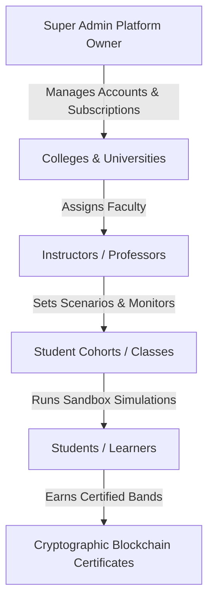

# DM SimLab — Academic & University Value Proposition
## Bridging the Digital Marketing Skill Gap with Real-Time Trend-Based Simulation

DM SimLab is a premium, cohort-enabled, trend-driven experiential learning simulator designed specifically for higher education institutions, business schools, and vocational training centers. It bridges the gap between academic theory and real-world execution by offering a completely risk-free sandbox environment where students can launch, optimize, and justify digital marketing campaigns based on real-time search trends.

---

## 1. Core Educational Pillars & Value Propositions

### A. Outcome-Based Education (OBE) & Accreditation Readiness
Modern academic accreditations (like AACSB, AMBA, EQUIS, and NBA) demand measurable evidence of students' learning outcomes. DM SimLab simplifies compliance:
* **Outcome Mapping**: Automatically evaluates students across specific performance dimensions: SEO Content Structure, Ads Budget Optimization, Adaptability (response to market events), and Strategic Rationale.
* **Accreditation Reports**: One-click PDF export of class dashboards providing programmatic, structured aggregate grades and data tables for departmental accreditation portfolios.
* **Granular Student Ledgers**: Detailed logs showing every single round-by-round budget change, keyword selection, and justification submitted by a student.

### B. The Trend-Driven Sandbox (No Real Budgets Required)
Students learn to respond to live consumer behavior changes without the risk of spending real money:
* **Trend Matching Engine**: Pulls real search demand volume shifts across industries (Tech, Retail, Travel, Finance) to dynamically adjust bidding auctions.
* **Cross-Channel Simulation**: Orchestrates simultaneous campaigns in Google Search Ads (keywords, match types, ad extensions), Meta Ads (placements, demographics, format types), and SEO Content (HTML markup, internal linking, authority growth).
* **Policy & compliance Guardrails**: Validates ad copy against built-in policies (trademark violations, deceptive claims, prohibited content). Soft violations trigger quality score drops; hard violations block certification, instilling professional ethics.

### C. Pedagogy of Reflection: The Checkpoint Justification
To counter "trial-and-error" click behaviors, DM SimLab enforces deliberate, logical planning:
* **Mandatory Reflection**: At the end of every simulation round, students *must* submit a text justification explaining their metrics performance and explaining their next-round strategies.
* **Instructor Review**: Instructors can review these justifications directly alongside campaign performance, grading students on critical thinking rather than just lucky performance outcomes.

---

## 2. Platform Roles & Features

### 1. Super Admin Dashboard (Institutional Management)
* **University Management**: Provision new universities and generate institutional onboarding access codes.
* **Plan & Subscription Controls**: Manage licensing tiers (Starter, Professional, Institutional) and active seat limits.
* **Revenue Analytics**: Track multi-college subscription payments, invoices, and active user metrics.

### 2. Instructor Portal (Classroom Command Center)
* **Cohort Management**: Create custom classrooms and automatically generate student invite/joining codes.
* **Live Monitoring**: View student progress in real-time, override and run custom market shock events, and lock/unlock simulation rounds.
* **Gradebooks & Exports**: Download comprehensive CSV/PDF reports detailing student metrics across performance, policy compliance, and adaptability scores.

### 3. Student & Learner Workspace (Interactive Console)
* **Google Ads Console**: Configure search campaigns with exact, phrase, and broad match keywords, site links, callouts, and custom bids.
* **Meta Ads Studio**: Launch visual campaigns targeted by demographic, interest, and platform placement (Instagram, Facebook, Messenger).
* **SEO Editor**: Upload raw HTML landing pages, optimize headers, setup internal links, and monitor domain authority growth.
* **Real-time Leaderboard**: Foster healthy gamification with cohort-wide performance standings.

---

## 3. Cryptographic Verification & Certifications

Students who complete the simulation suite with a satisfactory score are awarded verifiable digital badges corresponding to industry performance standards:

* **Certification Bands**:
  * **Platinum (90%+ overall score)**: Exceptional strategic execution, zero policy violations.
  * **Gold (80% – 89%)**: High efficiency, high quality score maintenance.
  * **Silver (70% – 79%)**: Balanced campaign structure with moderate optimization.
  * **Bronze (60% – 69%)**: Basic structural proficiency.
* **Verification Portal**: Every certificate includes a unique cryptographic verification hash. Employers can upload or search the certificate hash on the public platform portal to instantly verify credentials, student score break-downs, and date of issue.

---

## 4. Technical Integration & Deployment Simplicity

DM SimLab is optimized for easy institutional adoption:
* **Zero IT Overhead**: Delivered as a fully hosted SaaS platform or run on local institutional servers via Docker.
* **Mobile-Responsive Design**: Enables students to review metrics, check insights, and submit reflections from mobile, tablet, or desktop devices.
* **Security & Isolation**: Safe RBAC (Role-Based Access Control) isolates cohort data, grades, and student work.
