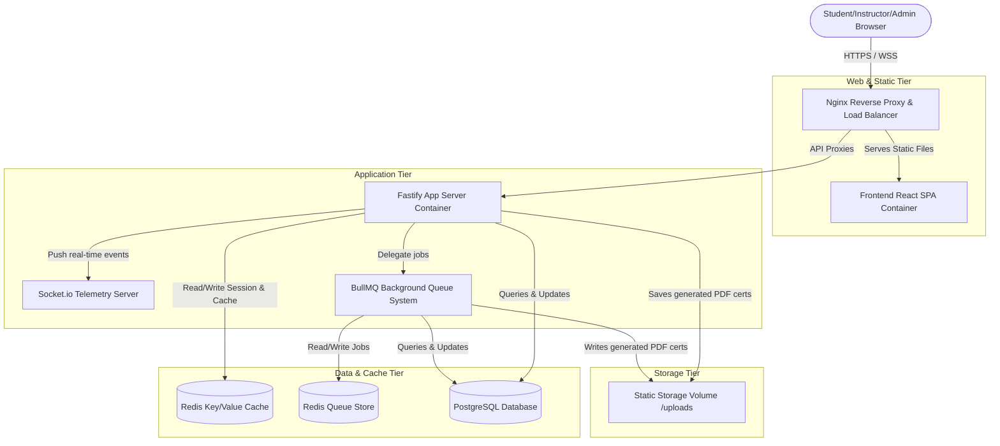

# SimLab Production Deployment Architecture

This document describes the multi-tier production architecture of SimLab using a Mermaid visual diagram.

---

---

## Component Layout & Responsibilities

1. **Nginx Reverse Proxy**: Terminate SSL, forward API calls to the Fastify container, and serve static HTML/JS/CSS assets with Gzip compression.
2. **Fastify Backend Server**: Process REST API requests, manage authentication middleware (Better Auth), and execute simulation configurations.
3. **BullMQ Background Workers**: Execute resource-intensive operations in separate event loop processes (e.g. certificate generation and metric compilation).
4. **Redis Cache & Queue Broker**: Act as the caching server for leaderboards and system states, and manage the message store for background jobs.
5. **PostgreSQL Database**: Serve as the persistent relational database for users, classes, simulations, and transaction receipts.
